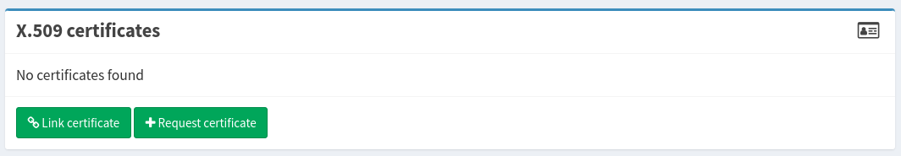
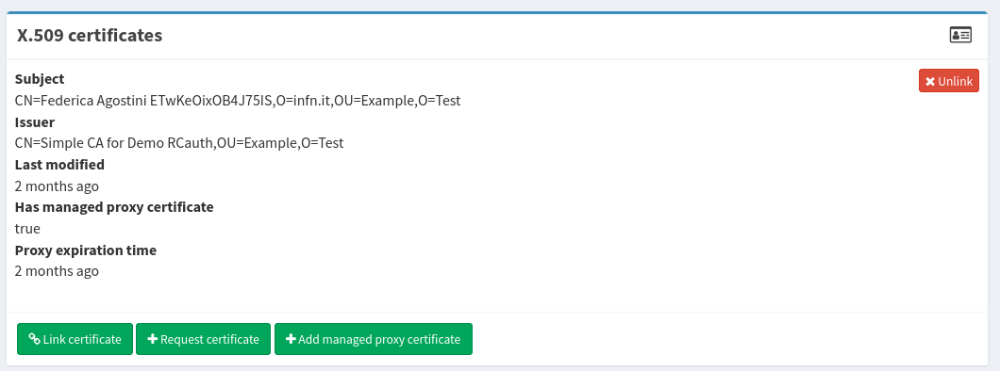

[RCAuth.eu][RCauth] has been integrated with IAM in order to provide on-demand X.509
certificates to users without a certificate.

RCAuth is basically an online Certificate Authority, which issues certificates
to end-entities based on a successful authentication to a Federated Identity Provider,
operated by an academic or research organization.

In particular, it extends the OAuth/OIDC specification to include the following endpoints:

* GetCert, to retrieve an X.509 end-entity certificate
* GetProxy, to retrieve a [RFC3820][proxy] Proxy Certificate chain

on behalf of the authenticated user.

## IAM deployment

### Configuration

The basic configuration required on your IAM deployment to enable the integration
of the service with RCAuth is

```bash
# Enable integration with RCAuth. Default to false
IAM_RCAUTH_ENABLED=true
# Select the hostname of your certificate authority, e.g. https://eir.nikhef.nl/oauth2
IAM_RCAUTH_ISSUER=
# A label for the certificate authority (not mandatory)
IAM_RCAUTH_LABEL=RCAuth.eu online CA
# Id of IAM client registered on RCAuth
IAM_RCAUTH_CLIENT_ID=
# Secret of IAM client registered on RCAuth
IAM_RCAUTH_CLIENT_SECRET=
```

### Client registration

An INDIGO IAM OAuth client has to be registered on the RCAuth service that will issue an
X.509/proxy certificate.

For instance, in case of the demo RCAuth hosted at `https://eir.nikhef.nl`,
one has to follow the next steps:

* go to the Client Registration Page `https://eir.nikhef.nl/oauth2/register` that will be
shown after a successful login with your institutional Identity Provider (e.g. the INFN AAI);

* fill the form with the details of your client. Important fields are

  * Callback URLs: _https://\<iam-hostname\>/rcauth/cb_;
  * Scopes: _openid_, _edu.uiuc.ncsa.myproxy.getcert_;

* after the request has been submitted, the service will generate a client ID and
secret that has to be set in the `IAM_RCAUTH_CLIENT_ID` and `IAM_RCAUTH_CLIENT_SECRET` environment
variables respectively;

* wait for the manual approval of your client registration.

## IAM user interface

The RCAuth issued certificate is listed in the __X.509 certificates__ tab
of the IAM homepage.

To add a new certificate click the _Request certificate_ button.



The user will be redirected to the RCAuth instance to authenticate and give consent
for the generation of an X.509 certificate, which will be accessible by IAM.  
Thus, IAM links the certificate to the user's dashboard, as shown in the example below.



A long-lived plain proxy obtained by the linked X.509 certificate is automatically
stored into the IAM database.  
This is shown in the IAM dashboard when the "__Has managed proxy certificate__"
string is set to _true_ (as in the image above).

The proxy certificate can be downloaded from IAM using the [Proxy certificate API](/docs/reference/api/proxycert-api/).

[RCauth]: https://rcauth.eu
[proxy]: https://datatracker.ietf.org/doc/html/rfc3820
