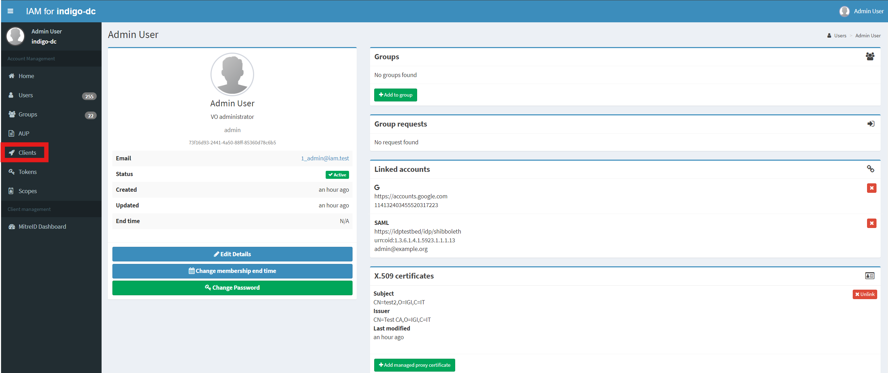
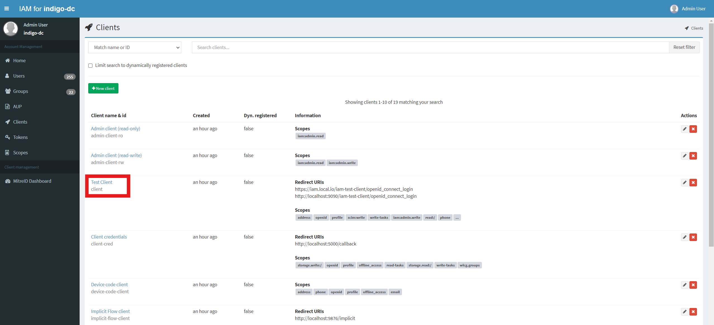
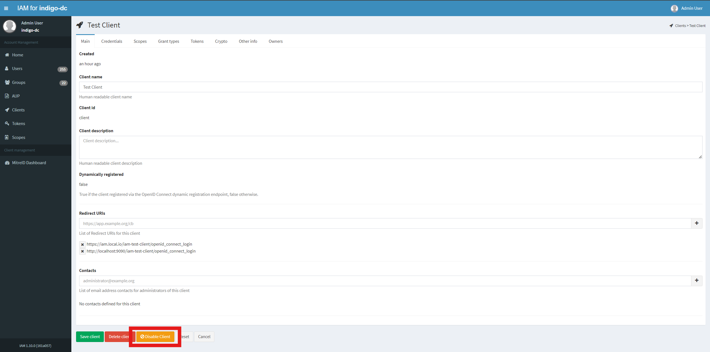
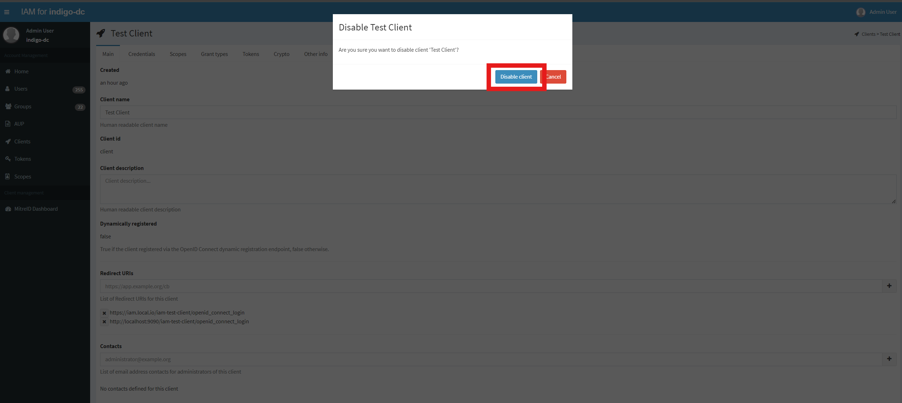

Existing clients can be disabled or enabled by Administrator from dashboard.

## Disabling a client using the dashboard

Log into the service using admin credentials and click on the _Clients_ link on the left
navigation bar:

From the _Clients_ link, select _Any client_ you want to disable, for example _Test Client_:

To disable the client click on _Disable Client_ button on the bottom of the page:

To confirm your choice click on _Disable Client_ button on the modal window:

On success you will get a confirmation message and the _Disable Client_ button will change to _Restore Client_:

Using _Restore Client_ button client status can be changed back to _Active_.
