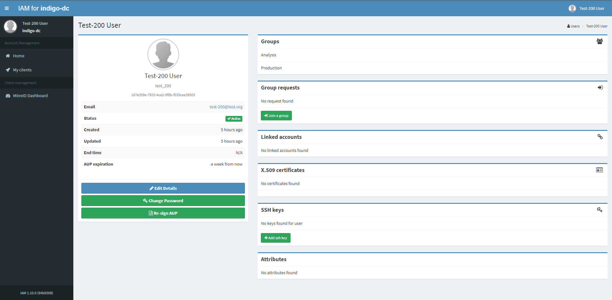
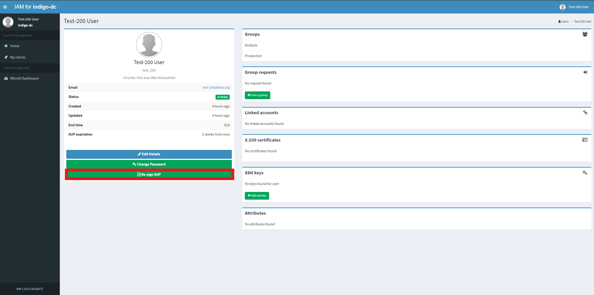
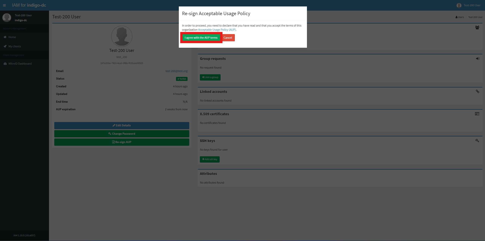

Users can re-sign AUP at any time.
## Re-sign AUP using the dashboard

Log into the service using user credentials:

To re-sign AUP click on _Re-sign AUP_ button:

To confirm your choice click on _I agree with the AUP terms_ button on the modal window:

On success you will get a confirmation message and _AUP expiration_ will be updated:

